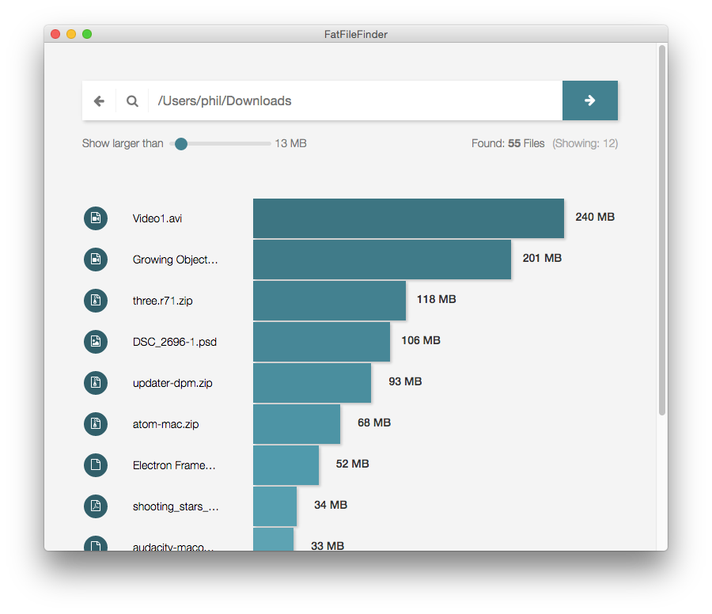

# FatFileFinder

Experimental [electron](http://electron.atom.io/) app which helps to find large files recursively on your filesystm. Build with [React](https://facebook.github.io/react/) and [Redux](https://github.com/rackt/redux) in ES6.

View [Video](https://youtu.be/6KVVW3l_XDs) 

For performance reasons FatFileFinder currently ignores files smaller than 1 MB (shouldn't matter if you are searching for the big boys).

# Download Mac OSX build

[FatFileFinder-0.1.0.zip](https://github.com/pwambach/fat-file-finder/releases/download/0.1.0/FatFileFinder-0.1.0.zip)

# Build it on your own

1. ´´´git clone ttps://github.com/pwambach/fat-file-finder.git && cd fat-file-finder´´
2. ´´´npm install´´´
3. ´´´webpack´´´
4. ´´electron .´´´

# License
MIT
